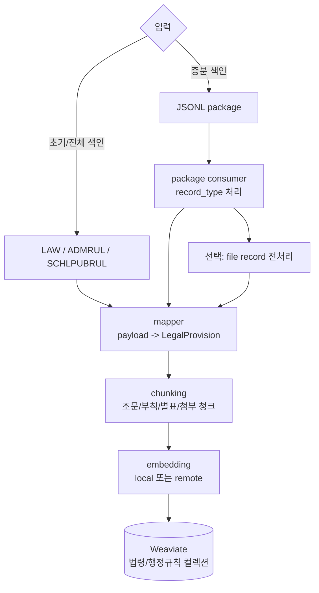

# law_embedding

이 프로젝트는 `temporal_law` 수집기가 만든 법령/행정규칙 **payload**(수집기가 문서 하나를 뽑아 정리한 JSON)를 읽어 Weaviate 검색 인덱스를 만든다.

수집은 하지 않는다. 역할은 **data repo 또는 package를 입력으로 받아 청킹, 전처리, 임베딩, Weaviate upsert/delete를 수행하는 것**이다. 여기서 **package**는 수집기가 변경분을 실어 보내는 JSONL 한 파일(한 줄에 record 하나)이고, **내부망 repo**는 망분리 환경에서 payload를 그대로 보관하는 data 레포(§5.5의 mirror 대상)다.

처음 볼 때는 아래 네 가지만 기억하면 된다.

| 질문 | 답 |
| --- | --- |
| 무엇을 읽나? | `LAW`·`ADMRUL`·`SCHLPUBRUL` 데이터 레포의 JSON payload 또는 수집기가 보낸 JSONL package |
| 무엇을 만들까? | 법령/행정규칙 조문, 부칙, 별표, 첨부파일 청크의 Weaviate 객체 |
| 임베딩 대상은? | `search_text`다. 법령명, 종류, 장, 조문번호, 제목, 본문을 합친 텍스트다. |
| 원본 repo를 고치나? | 기본 전체 색인은 읽기만 한다. package 소비 시 `PACKAGE_MIRROR_REPO=true`일 때만 내부망 repo를 갱신한다. |

현재 구현된 입력 원천은 두 가지다. DB dump는 필요한 경우 추가 구현해야 하는 후보 경로로만 정리한다.

| 입력 원천 | 구현 상태 | 설명 |
| --- | --- | --- |
| data repo | 구현됨 | `LAW`·`ADMRUL`·`SCHLPUBRUL` 폴더를 순회해 `.json` payload를 색인한다. 초기/전체 적재의 기본 경로다. |
| JSONL package | 구현됨 | `temporal_law` handoff package를 소비해 변경 문서만 upsert/delete한다. 증분 적재의 기본 경로다. |
| DB dump | 미구현 | DB dump만으로 초기 적재하려면 DB payload 조회, file_asset 원본 파일 위치, 첨부파일 전처리 경로를 별도로 구현해야 한다. |

## 1. 전체 구조



그림의 **`LegalProvision`**은 Weaviate에 들어가는 객체 하나 = 한 청크(조문·부칙·별표·첨부 한 조각)를 담는 자료구조이고, **`record_type`**은 package 각 줄이 어떤 종류인지(문서/파일/삭제 등, §2.2 표) 나타내는 태그다. 한 청크에는 저장·표시용 본문 `content`와 임베딩용 텍스트 `search_text`가 따로 있다. `search_text`는 `content` 앞에 법령명·종류·장·조문번호·제목을 붙여 문맥을 살린 값이라, 검색은 `search_text`로 하고 화면에 보여줄 원문은 `content`를 쓴다.

## 2. 입력 데이터

### 2.1 data repo

초기 적재나 전체 재색인은 data repo를 읽는다.

```text
data/
├── LAW/
│   └── {법령명}/{법률|시행령|시행규칙}/{문서명}.json
├── ADMRUL/
│   └── {문서명}/{문서명}.json                    ← 고시·훈령·예규
└── SCHLPUBRUL/
    └── {문서명}/{문서명}.json                    ← 학칙·공단정관·공공기관
```

- `.json`만 색인한다.
- `.md`는 사람용 문서라 색인하지 않는다.
- `_manifest.json`은 수집 상태 파일이라 색인하지 않는다.
- 세 레포는 서로 독립된 git repo다. 컬렉션도 3개 — 레포당 하나(`LAW`→`LegalProvisionIndex`, `ADMRUL`→`AdmrulProvisionIndex`, `SCHLPUBRUL`→`SchlPubRulProvisionIndex`).

### 2.2 JSONL package

증분 색인은 수집기가 만든 package를 읽는다.

package는 한 줄에 JSON 하나씩 들어 있는 JSONL이다. 첫 줄이 `package_header`면 새 package 계약으로 처리한다.

주요 record:

| record_type | 의미 |
| --- | --- |
| `package_header` | source, package_id, strategy 같은 package 메타 |
| `document` | 현재 문서 payload. 변경 문서는 이 record가 있어야 안전하게 재색인할 수 있다. |
| `preprocessed_chunk` | 수집기 쪽에서 이미 전처리한 첨부 청크 |
| `file` | 원본 파일. `content_b64` 또는 `transfer_name`으로 전달된다. |
| `pending_attachment` | 첨부를 처리하지 못했음을 표시 |
| `delete` | 폐지/삭제 문서의 Weaviate 청크 삭제 |
| `rename` | 문서 개명 통지 — 그 문서를 참조하던 청크의 meta 와 mirror 옛 폴더를 새 이름 기준으로 갱신([docs/package.md](docs/package.md) §2) |
| `package_footer` | record_count 검증용 |

## 3. 실행 준비

```bash
uv sync
cp .env.example .env
```

Weaviate 로컬 개발용 compose:

```bash
docker compose up -d
uv run python -m law_indexer health
```

컬렉션 생성:

```bash
uv run python -m law_indexer create-collection --source all
```

기존 컬렉션을 지우고 다시 만들 때만:

```bash
uv run python -m law_indexer create-collection --source law --recreate
```

## 4. 기본 실행

### 4.1 data repo 동기화

여기서 `sync`는 법제처 API 수집이 아니다. `LAW`·`ADMRUL`·`SCHLPUBRUL` Git repo를 clone/fetch해서 로컬 입력 폴더를 최신화하는 명령이다. 법제처 API 수집과 변경 감지는 `temporal_law`의 `pipeline.starter sync-now`가 담당한다.

```bash
uv run python -m law_indexer sync --source all
uv run python -m law_indexer sync --source law
uv run python -m law_indexer sync --source admrul
uv run python -m law_indexer sync --source schlpub
```

`sync`는 `LAW_REPO_URL`, `ADMRUL_REPO_URL`, `SCHLPUB_REPO_URL`에서 clone/fetch한다. `--source` 값은 `law` / `admrul` / `schlpub` / `both`(law+admrul, 옛 2repo 하위호환) / `all`(3종 전부)이고 기본은 `all`이다.

파일명이 길어 checkout이 실패하는 문서가 있으면 `sync`가 그 경로만 safe 이름으로 로컬에 풀고 나머지 checkout을 이어간다. git 쪽 원본 경로는 그대로 두므로 커밋 트리는 바뀌지 않는다.

### 4.2 전체 색인

```bash
uv run python -m law_indexer index --source all --skip-existing
```

한쪽만:

```bash
uv run python -m law_indexer index --source law --skip-existing
uv run python -m law_indexer index --source admrul --skip-existing
uv run python -m law_indexer index --source schlpub --skip-existing
```

특정 폴더만:

```bash
uv run python -m law_indexer index --source law --input ../data/LAW/근로기준법 --recursive
```

`--skip-existing`은 **기대 청크가 전부 들어 있는 문서만** 건너뛴다. 중단 후 이어받기용이며, 업서트가 반쯤 실패해 일부만 들어간 문서는 건너뛰지 않고 다시 채운다.

주요 옵션:

| 옵션 | 설명 |
| --- | --- |
| `--paths-file <파일>` | 줄바꿈으로 구분된 JSON 경로 목록만 처리한다. `--input` 대신 쓴다. |
| `--failed-out <파일>` | 실패 문서 경로를 저장한다(기본 `./index_failed_paths.txt`, 실패가 없으면 만들지 않는다). 그대로 `--paths-file` 입력으로 재처리한다. |
| `--files-only` | 본문 매핑을 건너뛰고 첨부 전처리 결과만 적재한다. 본문 청크는 그대로 두고 첨부만 뒤늦게 채울 때 쓴다. |
| `--vector-cache <parquet>` | 옛 컬렉션 export parquet를 임베딩 재사용 캐시로 쓴다. 같은 청크이고 `search_text`가 그대로면 임베딩 호출 없이 옛 벡터를 재사용한다. 속성·meta는 항상 새로 쓰므로 relation 확정 같은 meta 갱신은 캐시 적중과 무관하게 반영된다. |

실패 재처리:

```bash
uv run python -m law_indexer index --source law --paths-file index_failed_paths.txt
```

전처리를 2단계로 나눠 돌릴 때는 대상 문서를 먼저 뽑는다. `preprocess-targets`가 `[그림]` 마커, 파일 전용 별표, 문서 전용 파일을 가진 문서 경로를 원본 JSON에서 뽑아 준다.

```bash
uv run python -m law_indexer preprocess-targets --source admrul --out preprocess_targets.txt
uv run python -m law_indexer index --source admrul --paths-file preprocess_targets.txt
```

### 4.3 package 증분 소비

package 폴더를 계속 훑어 소비:

```bash
uv run python -m law_indexer consume-folder --dir /mnt/handoff/packages
```

package 하나만 소비한다. 명령 이름 `index-changeset`은 개념상 package를 소비하지만, 옛 changeset 시절 이름이 그대로 남은 것이다.

```bash
uv run python -m law_indexer index-changeset --input /mnt/handoff/packages/law-20260814-010000-3f9ac1.jsonl
```

package 파일명은 `{source}-{생성시각}-{무작위 6자리}.jsonl`이다. 무작위 접미는 같은 초에 만들어진 package끼리 서로 덮어쓰지 않게 하려는 것이라, 순서나 내용은 파일명이 아니라 `package_header`로 판단한다.

첫 줄이 `package_header`면 source는 header에서 자동으로 읽는다. 옛 1세대 changeset이면 `--source law|admrul`이 필요하다.

### 4.4 검색 확인

```bash
uv run python -m law_indexer search --source law --query "연차 유급휴가 사용 촉진" --limit 5
uv run python -m law_indexer search --source admrul --query "국세통계센터 이용 절차" --limit 5
```

## 5. 주요 ENV

### 5.1 Weaviate

| env | 설명 |
| --- | --- |
| `WEAVIATE_HTTP_HOST`, `WEAVIATE_HTTP_PORT` | Weaviate HTTP 주소 |
| `WEAVIATE_GRPC_HOST`, `WEAVIATE_GRPC_PORT` | Weaviate gRPC 주소 |
| `WEAVIATE_API_KEY` | 법령 컬렉션 API key. 인증 없으면 비움 |
| `ADMRUL_WEAVIATE_API_KEY` | 행정규칙 컬렉션 API key. 없으면 `WEAVIATE_API_KEY`로 폴백 |
| `SCHLPUB_WEAVIATE_API_KEY` | 학칙공단 컬렉션 API key. 없으면 `WEAVIATE_API_KEY`로 폴백 |
| `WEAVIATE_SECURE` | TLS 사용 여부 |
| `LAW_COLLECTION` | 법령 컬렉션 이름. 기본 `LegalProvisionIndex` |
| `ADMRUL_COLLECTION` | 행정규칙 컬렉션 이름. 기본 `AdmrulProvisionIndex` |
| `SCHLPUB_COLLECTION` | 학칙공단 컬렉션 이름. 기본 `SchlPubRulProvisionIndex` |

### 5.2 임베딩

| env | 설명 |
| --- | --- |
| `EMBEDDING_BACKEND` | `local` 또는 `remote` |
| `EMBEDDING_MODEL` | 임베딩 모델명 |
| `EMBEDDING_BATCH_SIZE` | remote/local embed 요청 배치 크기 |
| `NORMALIZE_EMBEDDINGS` | 벡터 정규화 여부 |
| `EMBEDDING_API_URL` | `EMBEDDING_BACKEND=remote`일 때 `/v1/embeddings` endpoint |
| `EMBEDDING_API_KEY` | remote embedding 인증이 필요할 때 |
| `EMBEDDING_TIMEOUT`, `EMBEDDING_MAX_RETRIES` | remote embedding 타임아웃·재시도(기본 180초·3회) |

주의:

- 같은 컬렉션에는 같은 모델/차원의 벡터만 넣는다.
- 모델을 바꾸면 컬렉션을 재생성하고 재색인한다.

### 5.3 data repo

| env | 설명 |
| --- | --- |
| `INPUT_DATA_PATH` | `LAW`·`ADMRUL`·`SCHLPUBRUL` 레포를 담은 루트 |
| `LAW_REPO_URL`, `LAW_REPO_PATH`, `LAW_REPO_BRANCH` | 법령 repo 설정 |
| `ADMRUL_REPO_URL`, `ADMRUL_REPO_PATH`, `ADMRUL_REPO_BRANCH` | 행정규칙 repo 설정 |
| `SCHLPUB_REPO_URL`, `SCHLPUB_REPO_PATH`, `SCHLPUB_REPO_BRANCH` | 학칙공단 repo 설정 |
| `GIT_SYNC_TIMEOUT` | clone/fetch timeout |

repo URL 기본값은 `genonai` 조직의 `LAW`·`ADMRUL`·`SCHLPUBRUL`이고, 경로 기본값은 `INPUT_DATA_PATH` 아래 같은 이름 폴더다. 망분리 환경에서는 bundle 파일 경로를 URL 자리에 그대로 넣어도 된다.

### 5.4 전처리기

전처리는 “본문 JSON만으로는 검색 가능한 텍스트가 부족한 파일”을 FILE 청크로 만들 때만 필요하다. 조문/부칙/텍스트 별표처럼 payload 안에 이미 텍스트가 있는 내용은 전처리기를 거치지 않고 바로 청킹한다.

이 설정은 임베딩기 쪽 전처리 설정이다. 수집기에서 전처리한 package를 만들 때 쓰는 `PREPROCESS_*`, `PACKAGE_PREPROCESS_*` 설정은 `temporal_law`에 있고, 여기서는 package에 들어온 `file` record나 초기 색인 중 필요한 파일을 처리할 때 `DOC_PARSER_*`를 쓴다. 아래 표는 어떤 env가 언제 필요한지를 보기 위한 요약이고, 대상 판정 규칙과 endpoint 분기의 정본은 [docs/indexer.md](docs/indexer.md) §6이다.

| 케이스 | 전처리 여부 | 이유 |
| --- | --- | --- |
| 법령/행정규칙 조문 본문 | 안 함 | payload에 이미 텍스트가 있으므로 바로 JSON 청크를 만든다. |
| 부칙, 개정문, 텍스트 별표/별지 | 안 함 | payload 안의 구조화 텍스트를 그대로 청킹한다. |
| 법령류 본문 이미지 | 안 함 | 조문 본문 텍스트가 이미 있고, 이미지는 수식/표 조각인 경우가 많아 중복과 비용이 커서 제외한다. |
| `appendices[].is_file_only=true` 별표/별지/서식 | 함 | 파일 안에만 본문이 있으므로 첨부용 전처리 결과가 있어야 FILE 청크를 만들 수 있다. |
| 본문 텍스트가 없는 행정규칙 원문 파일 | 함 | 원문 파일이 실제 본문 역할을 하므로 첨부용 전처리 대상이다. |
| 행정규칙 조문 안 `[그림]` 본문이미지 | 함 | 조문 텍스트 중 이미지로 빠진 부분을 이미지/지능형 전처리기로 보강한다. |
| package의 `preprocessed_chunk` | 안 함 | 수집기 쪽에서 이미 전처리된 결과이므로 그대로 FILE 청크로 만든다. |
| package의 `file` record | 설정에 따라 함 | `DOC_PARSER_BASE_URL`이 있으면 내부망에서 전처리하고, 없으면 pending으로 남긴다. |
| package의 `pending_attachment` | 안 함 | 생산자가 이미 처리 보류로 표시한 record라 색인 객체를 만들지 않는다. |

| env | 설명 |
| --- | --- |
| `DOC_PARSER_BASE_URL` | 내부망 전처리기 주소. 비우면 file record와 file-only 첨부는 pending/오류로 남고 FILE 청크를 만들지 않는다. |
| `DOC_PARSER_ENDPOINT_PATH` | 첨부용 전처리 endpoint. hwp/hwpx/pdf/docx 같은 파일 전처리에 쓴다. 예: `/preprocess_attachment_upload` |
| `DOC_PARSER_IMAGE_ENDPOINT_PATH` | 이미지/지능형 전처리 endpoint. 행정규칙 본문 `[그림]` OCR에만 쓴다. 비우면 첨부용 endpoint를 같이 사용한다. |
| `DOC_PARSER_IMAGE_CONCURRENCY` | 같은 문서 안 이미지 OCR 동시 호출 수(기본 1=순차). 본문이미지가 많은 문서의 처리 시간을 줄인다. |
| `DOC_PARSER_UPLOAD` | multipart 업로드 여부 |
| `DOC_PARSER_API_KEY` | Bearer 인증 |
| `DOC_PARSER_TIMEOUT`, `DOC_PARSER_MAX_RETRIES` | 전처리 호출 timeout/retry |
| `DOC_PARSER_SHARED_*` | path 방식 전처리기와 파일 경로를 공유할 때 사용 |

전처리기 응답은 `code=0`, `data[]` 형태를 기대한다. 각 `data[]`의 `text`, `i_page`, `e_page`, `i_chunk_on_doc`, `n_char`, `chunk_bboxes`, `media_files` 등을 읽어 `content`, `page_no`, `start_page`, `end_page`, `chunk_index` 같은 FILE 청크 메타로 정규화한다.

### 5.5 package 소비 옵션

| env | 설명 |
| --- | --- |
| `PACKAGE_FILE_INBOX_DIR` | `file_transfer`로 온 파일을 읽는 폴더 |
| `PACKAGE_DELETE_CONSUMED_FILES` | 전처리 성공한 inbox 파일 삭제 여부 |
| `PACKAGE_MIRROR_REPO` | package 소비 시 내부망 data repo 구조를 갱신할지 |
| `PACKAGE_MIRROR_PUSH` | mirror 후 내부 Git 서버로 commit/push할지 |
| `PACKAGE_STORE_ORIGINAL` | repo 외 별도 원본 저장소에 document/file을 보관할지 |
| `PACKAGE_ORIGINAL_DIR` | 별도 원본 저장소 경로 |
| `PACKAGE_DELETE_CONSUMED_PACKAGE` | 성공한 package JSONL 삭제 여부 |

package 소비 시 `DOC_PARSER_BASE_URL`이 있으면 `file` record는 자동으로 내부망 전처리 대상이 된다. 없으면 파일 record는 pending으로 남고 package 소비는 계속된다.

### 5.6 색인 실행 옵션

| env | 설명 |
| --- | --- |
| `INDEX_PREPROCESS_FILES` | 초기 색인에서 첨부/`[그림]` 전처리를 할지(기본 true). 벌크는 끄고 돌린 뒤 대상 문서만 켜서 다시 돌리는 2단계 운영에 쓴다. |
| `INDEX_EMBED_FLUSH` | 임베딩 벌크 플러시 크기(기본 256) |
| `TEMPORAL_ADDRESS`, `TEMPORAL_NAMESPACE`, `TEMPORAL_TLS` | Temporal 워커 접속(기본 `localhost:7233` / `default` / false) |
| `INDEX_TASK_QUEUE` | 워커가 폴링할 Task Queue(기본 `law-embedding`) |
| `INDEX_ACTIVITY_WORKERS` | activity 실행 스레드 수(기본 2) |

CLI 대신 Temporal 워커로 같은 작업을 돌릴 수도 있다. `InitialIndexWorkflow`(초기 full 색인)와 `ConsumePackageWorkflow`(package 1개 소비)를 제공한다.

```bash
uv run python -m law_indexer worker
```

## 6. 문서

| 문서 | 내용 |
| --- | --- |
| [docs/indexer.md](docs/indexer.md) | 초기/전체 색인 흐름, 청킹, 전처리 대상 |
| [docs/package.md](docs/package.md) | JSONL package 소비 흐름과 record 처리 |
| [docs/schema.md](docs/schema.md) | Weaviate 컬렉션과 필드 구조 |
| [docs/flow.md](docs/flow.md) | 전체 흐름 Mermaid |
