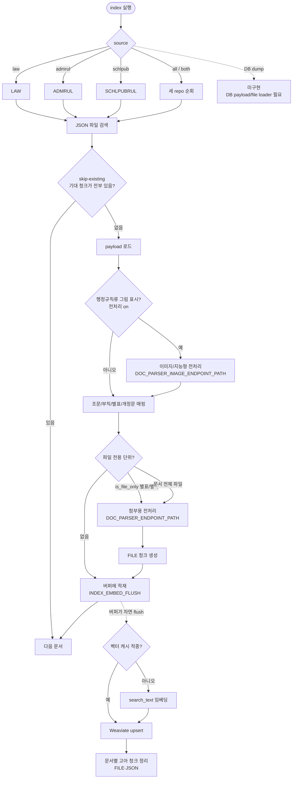
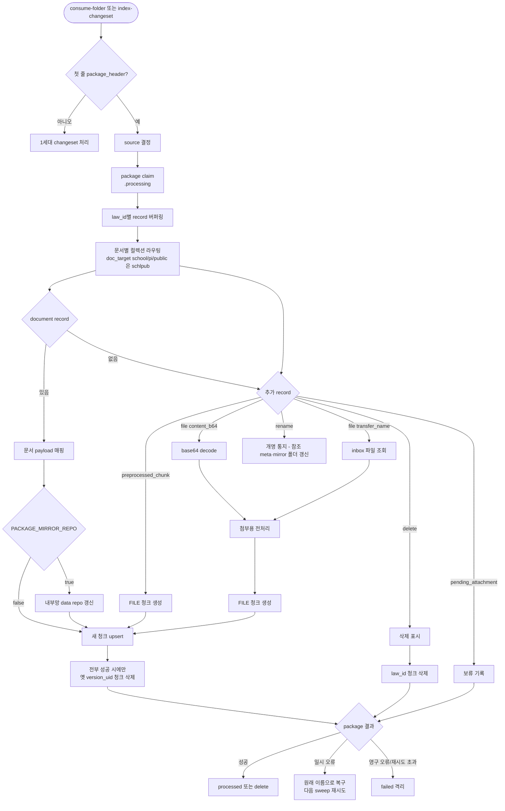
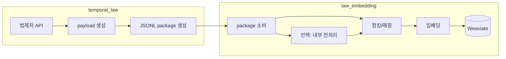

# 흐름도

## 1. 초기/전체 색인

이 흐름은 초기/전체 색인이다. data repo의 JSON을 하나씩 열어 조문·부칙·별표로 청킹하고, 파일에만 본문이 있는 단위만 전처리를 거쳐 FILE 청크로 만든 뒤, 임베딩 대상 텍스트(`search_text` — 저장용 본문 `content`에 법령명·조문번호 같은 문맥을 붙인 값)를 벡터로 만들어 Weaviate에 upsert한다.

임베딩·upsert는 문서마다 즉시 하지 않고 문서 경계를 넘어 버퍼에 모았다가 한 번에 흘린다. 실패 집계와 고아 청크 정리는 flush 시점에 문서 단위로 한다. `--vector-cache`를 주면 안 바뀐 청크는 임베딩을 건너뛰고 옛 벡터를 재사용한다([indexer.md](indexer.md) §7).

## 2. package 증분 소비

증분 소비는 package(JSONL) 하나를 원자적으로 잡아 처리한다. `claim`은 package 파일 이름을 `.processing`으로 바꿔 "내가 처리 중"임을 표시하는 것(다른 소비자나 재실행과 겹치지 않게)이고, `sweep`은 폴더를 반복해서 훑어 아직 처리 안 된 package를 집는 순회를 뜻한다. 문서를 새로 upsert한 뒤에는 같은 문서의 옛 `version_uid`(=문서+버전 식별키) 청크를 지워 한 버전만 남긴다 — 단, 새 청크가 **전부** 들어갔을 때만 지운다.

## 3. 수집기와 임베딩기 역할

수집기(`temporal_law`)가 payload와 package를 만들고, 임베딩기(`law_embedding`)는 그 package를 소비해 청킹·(필요 시) 전처리·임베딩만 한다. package를 무엇으로 채울지 고르는 규칙과 `manifest`(수집기가 어떤 문서·버전을 내보냈는지 적어 두는 목록) 관리는 수집기 몫이고, 자세한 계약은 [package.md](package.md)와 수집기 문서를 본다.

## 4. 읽는 법

- 데이터 레포 3개(LAW·ADMRUL·SCHLPUBRUL)와 컬렉션 3개(Legal·Admrul·SchlPubRul ProvisionIndex)는 1:1이다. 초기/전체 색인은 `--source`가 곧 레포이자 컬렉션이고, 증분은 package source가 `law`/`admrul` 둘뿐이라 소비자가 문서 단위로 schlpub을 갈라낸다.
- 초기/전체 색인은 현재 data repo의 JSON 파일을 순회한다. DB dump만 받아 바로 색인하는 경로는 아직 없고, 구현하려면 DB payload loader와 file_asset 원본 파일 위치 규칙이 필요하다.
- 전처리기는 두 갈래다. 별표/별지/서식/원문 파일은 첨부용 endpoint를 쓰고, 행정규칙 본문 `[그림]`은 이미지/지능형 endpoint를 쓴다. 법령 본문 `[그림]`은 OCR하지 않는다.
- package 소비는 `law_id`별로 record를 모은 뒤 Weaviate에 반영한다. 일부 파일 전처리 실패는 pending으로 남길 수 있지만, Weaviate upsert 같은 문서 단위 오류는 package 재시도/failed 흐름을 탄다.
- `law_embedding`은 package를 만드는 쪽이 아니다. package 생성 규칙과 manifest 모드는 `temporal_law` 문서를 보고, 여기서는 도착한 package를 어떻게 소비하는지만 다룬다.
